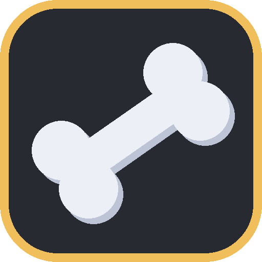
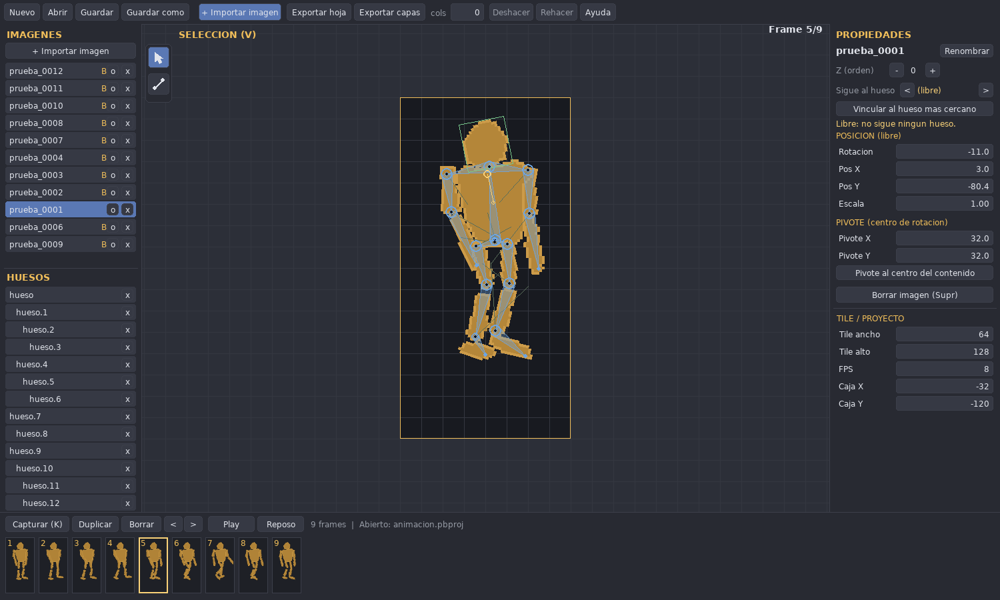
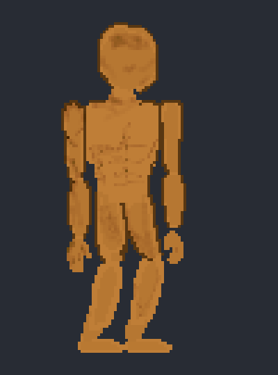
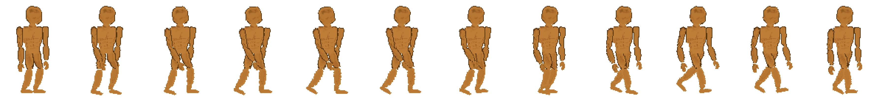

# PixelBones

Editor libre de **animación esquelética (cutout / huesos)** para pixel art.
Importas las piezas de tu personaje (torso, cabeza, brazo, antebrazo, mano,
muslo, pierna, pie…), las enlazas como huesos en jerarquía, las mueves/rotas,
**capturas un frame**, repites, y exportas un **spritesheet PNG de tiles
uniformes** (64×64, 64×128, lo que definas).

No está atado a ningún juego: sirve para personas, animales o cualquier set
de imágenes. WYSIWYG: el recuadro naranja es exactamente lo que se exporta.

## Descargar y ejecutar (sin instalar nada)

Descarga el ejecutable de tu sistema desde la página de
**[Releases](https://github.com/StivenColorado/pixelBones/releases)** y ábrelo —
no necesitas Python ni instalar dependencias:

| Sistema | Archivo |
|---|---|
| Windows | `PixelBones-windows.exe` (doble clic) |
| Linux | `PixelBones-linux` (`chmod +x` y ejecutar) |
| macOS | `PixelBones-macos` |

> Los binarios los compila automáticamente GitHub Actions en cada versión
> (Windows/Linux/macOS). Si prefieres correrlo desde el código, ve a
> *Instalación y ejecución*.

## Demo

El editor con un proyecto real (esqueleto, sprites vinculados, máscara de
rotación y línea de tiempo con los frames):



| Animación (reproducida) | Spritesheet exportado |
|---|---|
|  |  |

A la izquierda, la animación reproduciéndose con **Play**; a la derecha, la
hoja de tiles PNG que genera *Exportar hoja* (9 frames de 64×128).

## Dos modos: Animar y Pintar (`Tab`)

PixelBones es a la vez un **rig de huesos** y un **editor de pixel art**, así que
no necesitas otra herramienta para dibujar las piezas.

- **Animar** (por defecto): la escena con materiales, huesos, poses y timeline.
- **Pintar**: un **taller** aparte. Dibujas en lienzos con **capas** estilo
  Pixelorama, **sin** tocar la animación; al terminar pulsas **"Enviar →
  material"** y el dibujo se **copia** a Animación como un sprite nuevo (seguir
  editando el dibujo ya no afecta al material). Para retocar un material que ya
  está en la escena, abre sus Propiedades y usa **"Editar en Pintar (copia)"**.
  `Tab` alterna entre ambos modos.

Herramientas de Pintar (teclas iguales a Pixelorama):

| Tecla | Herramienta | | Tecla | Herramienta |
|---|---|---|---|---|
| `P` | Lápiz | | `O` | Cuentagotas |
| `E` | Borrador | | `H` | Mano (paneo) |
| `C` | Sombreador | | `L` | Línea |
| `B` | Bote (relleno) | | `J` | Curva |
| `W` | Vara mágica | | `[` `]` | Tamaño de pincel |

`X` intercambia color activo/secundario. La **vara mágica** selecciona la región
de color contigua y acota el pincel a ella (`Esc`/`Supr` la limpian/borran). El
panel izquierdo muestra las **capas** (crear, ocultar, reordenar, borrar,
renombrar con `F2`); el derecho, el **color/paleta/pincel** y los botones
**"Aplanar → asset base"** / **"Aplanar → PNG nuevo"** para volcar la imagen al
PNG que consume tu juego. Los píxeles se guardan dentro del `.pbproj`
(comprimidos), así que las capas siguen editables al reabrir.

## Requisitos

- Python 3.10+
- `pygame-ce` (ver `requirements.txt`) — única dependencia. El explorador de
  archivos es propio (en pygame), no usa tkinter.

## Instalación y ejecución

```bash
cd PixelBones
python3 -m venv venv
./venv/bin/pip install -r requirements.txt
./venv/bin/python main.py
```

## Compilar el ejecutable (opcional)

Para generar tu propio binario con el icono incluido:

```bash
./venv/bin/pip install pyinstaller pillow
./venv/bin/python tools/make_icon.py     # regenera docs/icon.png + icon.ico
./venv/bin/pyinstaller --noconfirm --clean PixelBones.spec
# resultado en dist/  (PixelBones.exe en Windows, PixelBones en Linux/macOS)
```

Para publicar binarios de las 3 plataformas: crea un tag `vX.Y.Z` y haz push
(`git tag v1.0.0 && git push --tags`); el workflow `.github/workflows/build.yml`
los compila y los adjunta a la Release automáticamente.

## Modelo (estilo PixelOver)

Las **imágenes son sprites libres** (no son huesos). Los **huesos** se crean
aparte como cilindros con nodos, y luego se **vinculan** los sprites a los
huesos para animarlos. Hay dos herramientas (barra vertical en el lienzo):

- 🖱 **Selección (`V`)**: clic en una imagen y arrastra para **moverla**.
  También selecciona y **posa huesos**: arrastra el *cuerpo* del hueso para
  rotarlo, o el *nodo de la cabeza* para moverlo.
- 🦴 **Hueso (`B`)**: clic en el **punto de inicio (nodo)** y arrastra hasta el
  extremo para crear el hueso. Si empiezas cerca de la **punta** de otro hueso,
  el nuevo se **encadena** como hijo (jerarquía padre→hijo).

## Flujo de trabajo

1. **+ Importar imagen** (botón o arrastra PNG a la ventana). Entran como
   sprites libres; muévelos con la herramienta Selección.
2. Con la herramienta **Hueso (`B`)** dibuja el esqueleto (cilindros),
   encadenando desde las puntas (ej. torso → brazo → antebrazo → mano).
3. Selecciona cada imagen y en **Propiedades** elige su **Hueso** (`<` / `>`)
   para vincularla; el sprite se queda donde está y desde ahí sigue al hueso.
4. **Posa** los huesos (herramienta Selección) y pulsa **Capturar (`K`)** por
   cada frame. 10 capturas = 10 tiles.
5. **Play** para previsualizar a los FPS configurados.
6. **Exporta**:
   - *Exportar hoja*: una sola hoja compuesta (todos los sprites aplanados).
   - *Exportar capas*: una hoja por sprite, todas alineadas.
   - `cols` = 0 produce una tira horizontal; >0 produce una rejilla.

## Jerarquía (cinemática directa / FK)

Mover o rotar un hueso **padre** arrastra a todos sus hijos; editar un **hijo**
nunca altera al padre. Es el comportamiento natural de un esqueleto. No se
permiten ciclos al asignar padre.

## Atajos

| Acción | Tecla |
|---|---|
| Herramienta Selección / Hueso | `V` / `B` |
| Capturar frame | `K` |
| Play / Detener | `Espacio` |
| Renombrar selección | `F2` |
| Borrar selección | `Supr` |
| Deseleccionar | `Esc` |
| Zoom / Paneo | rueda / botón central |
| Ajustar rotación a 15° | `Ctrl` mientras rotas |
| Guardar / Guardar como | `Ctrl+S` / `Ctrl+Shift+S` |
| Abrir / Nuevo | `Ctrl+O` / `Ctrl+N` |
| Exportar hoja | `Ctrl+E` |
| Deshacer / Rehacer | `Ctrl+Z` / `Ctrl+Y` (o `Ctrl+Shift+Z`) |
| Ayuda | `H` / `F1` |

## Archivos

- Proyectos: **`.pbproj`** (JSON legible; las rutas de imagen se guardan
  relativas al proyecto para que sea portable).
- **Recuperación ante cierre brusco**: cada 15 s se autoguarda el estado en
  `~/.pixelbones/recovery.json`. Si el programa se cierra de golpe, al reabrir
  se ofrece *Recuperar*. Un guardado manual limpia ese archivo.
- El título de la ventana muestra `*` cuando hay cambios sin guardar.

## Arquitectura (para extender)

```
pixelbones/
  model.py        datos + matemática (sprites, huesos, FK; puro, sin pygame)
  render.py       dibujo y exportación con pygame (comparte la matemática)
  history.py      deshacer/rehacer por snapshots
  recovery.py     autosave / recuperación ante cierre brusco
  filebrowser.py  explorador de archivos propio (en pygame, sin tkinter)
  dialogs.py      capa fina sobre filebrowser (abrir/guardar/exportar)
  app.py          editor interactivo (bucle, herramientas, paneles, timeline)
main.py           punto de entrada
```

El núcleo (`model` + `render`) no depende de la GUI, así que se puede usar como
librería para generar spritesheets por script.

## Licencia

Software libre. Úsalo, modifícalo y compártelo.
